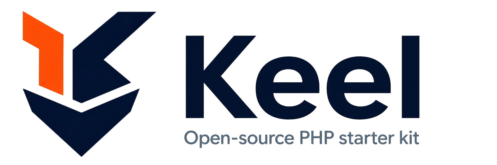

<picture>
   <source media="(prefers-color-scheme: dark)" srcset="resources/images/brand/keel-light.png">
   
</picture>

# Keel

Santos Rivera's PHP starter kit. A consistent foundation for new SaaS projects: custom MVC, OTP + Magic Link auth (no passwords, ever), a mailer, and a complete interface built on Deck — installed by Composer, with no build step.

## Stack

- PHP 8.2, custom MVC (no framework dependency)
- MySQL via PDO
- [Deck](https://get-deck.dev) CSS, published by Composer. No npm, no bundler, no build step.
- Vanilla JS
- PHPMailer (SMTP + log driver)
- Stripe Checkout + Billing Portal for subscription billing
- Local/private file storage abstraction
- Anthropic API wrapper for text, JSON, and image-assisted prompts
- DB-backed queue worker for async jobs
- Optional one-organization-per-user multi-tenancy layer
- OTP and/or Magic Link auth — toggle in `.env`
- CSRF protection, request throttling, and branded error pages

## Directory structure

```
public_html/       Web root. Only this folder is exposed by the server.
  index.php         Front controller — every request enters here.
  css/keel.css      Keel's own CSS, in the app.* layers Deck reserves.
  js/keel.js        Theme persistence and confirmation dialogs. No build step.
  deck/             Deck, published by `composer install`. Git-ignored.
  uploads/           User-uploaded files.
src/
  Core/              Framework internals: Router, Request, Response, Database,
                                 Session, View, Mailer, Env, Controller, Middleware,
                                 Csrf, RateLimiter, ErrorHandler, Storage.
  App/
    Controllers/      Your route handlers.
    Middleware/        Route guards (AuthMiddleware included).
    Models/            Thin data-access classes.
      Services/          Business logic (OtpService, MagicLinkService, AiService).
routes/
  web.php            All routes are registered here.
views/               Plain PHP templates. No templating engine —
                      views/partials/head.php + one file per page, same as
                      the pattern you've used across keel/Mise/ShiftDeduct.
resources/
  images/            Brand source images.
database/
   migrations/         Plain .sql files, run with `php database/migrate.php`.
   migrate.php         CLI runner for pending SQL migrations.
   queue-work.php      CLI worker for queued jobs.
storage/logs/         App logs (error_log target if you wire one in).
storage/app/          Private uploaded files, not web-accessible.
```

## Setup

1. **Install dependencies**
   ```
   composer install
   ```
   This also publishes Deck's stylesheet, icon sprite and scripts into `public_html/deck/`. There is nothing else to install and nothing to compile.

2. **Environment**
   ```
   cp .env.example .env
   ```
   Fill in `DB_*`, `MAIL_*`, and set `APP_URL` to wherever this is served locally (e.g. `http://keel.local` following your existing local-dev pattern, or `http://localhost:8000`).

   Fastest local auth smoke test without SMTP setup:

   ```
   MAIL_MAILER=log
   ```

   Then request an OTP or magic link and read `storage/logs/mail.log` for the code or URL.

   Quick troubleshooting for `MAIL_MAILER=log`:

   ```text
   [2026-07-10 02:58:48] MAIL_MAILER=log
   To: you@example.com <you@example.com>
   Subject: Your verification code

   Text Body:
   Keel App verification code
   Use this code to sign in. It expires in 10 minutes.
   315638
   ```

   For OTP, use the 6-digit code in `Text Body`.
   For magic-link auth, open the `/auth/magic?token=...&email=...` URL logged in the same entry.

3. **Database**
   ```
   php database/migrate.php
   ```
   This creates the configured database automatically if it does not exist yet, runs any pending SQL files in `database/migrations/`, records them in a `migrations` table, and creates `users`, `auth_tokens`, and any later starter-kit tables such as `subscriptions`.
   Your `DB_USERNAME` must have permission to create databases on the target MySQL server.

   Security-related tables such as `rate_limits` are created by later migrations the same way.

4. **File storage + AI config**
   Add these to `.env` for upload handling and Anthropic-powered features:

   ```
   FILESYSTEM_DISK=local
   FILESYSTEM_MAX_UPLOAD_MB=10
   FILESYSTEM_ALLOWED_EXTENSIONS=pdf,jpg,jpeg,png,heic
   ANTHROPIC_API_KEY=
   ANTHROPIC_MODEL=claude-sonnet-4-5
   ```

   Public uploads are stored under `public_html/uploads/`. Private uploads are stored under `storage/app/` and are only served through authenticated controller checks.

5. **Optional multi-tenancy**

   ```env
   MULTI_TENANCY_ENABLED=false
   ```

   Leave this `false` and Keel behaves exactly as it does today. Set it to `true` for one organization per user, invite-based teammate onboarding, org admin settings, and a platform-level super-admin area.

6. **Stripe billing (optional, but included in the kit)**
   Add these to `.env` when you want to test or ship subscription billing:

   ```
   STRIPE_SECRET_KEY=
   STRIPE_PUBLISHABLE_KEY=
   STRIPE_WEBHOOK_SECRET=
   STRIPE_PRICE_PRO_MONTHLY=
   ```

   For local webhook testing, use the Stripe CLI:

   ```
   stripe listen --forward-to keel.local/webhooks/stripe
   ```

   Stripe prints a temporary signing secret. Put that value into `STRIPE_WEBHOOK_SECRET` locally instead of using a live dashboard secret.

7. **Choose your auth method**
   In `.env`:

   ```
   AUTH_METHOD=otp          # OTP only
   AUTH_METHOD=magic_link   # Magic link only
   AUTH_METHOD=both         # Both, with a tab switcher on the login page
   ```

8. **Local vhost (XAMPP), same pattern as keel.local**

   a. Copy this project into `C:\xampp\htdocs\keel` (so the front controller lives at `C:\xampp\htdocs\keel\public_html\index.php`).

   b. Add to `C:\Windows\System32\drivers\etc\hosts`:
      ```
      127.0.0.1 keel.local
      ```

   c. Add to `C:\xampp\apache\conf\extra\httpd-vhosts.conf`:
      ```
      <VirtualHost *:80>
          ServerName keel.local
          DocumentRoot "C:/xampp/htdocs/keel/public_html"
          <Directory "C:/xampp/htdocs/keel/public_html">
              Options Indexes FollowSymLinks
              AllowOverride All
              Require all granted
          </Directory>
      </VirtualHost>
      ```
      `AllowOverride All` is required — without it, `public_html/.htaccess` is ignored and every route except `/` 404s.

   d. Confirm `httpd-vhosts.conf` is loaded — in `C:\xampp\apache\conf\httpd.conf` there should be an uncommented `Include conf/extra/httpd-vhosts.conf`. If you already have `keel.local` working, this is already done.

   e. Restart Apache from the XAMPP control panel.

   f. Set `APP_URL=http://keel.local` in `.env`.

   `public_html/.htaccess` is already in the project — it rewrites any request that isn't a real file to `index.php`, which is what lets `/login`, `/dashboard`, etc. resolve through the router instead of 404ing.

9. **Front-end assets**

   There is no asset pipeline. Keel's entire interface — all 30 views and 4 shared partials, including the passwordless sign-in flow, the Stripe billing screens, the org and super-admin tables, and these docs — is built in [Deck](https://get-deck.dev), a CSS framework installed by Composer. There is no npm, no bundler, no build step and no `package.json`.

   `composer install` copies Deck into `public_html/deck/`, and `views/partials/head.php` emits the tags with `Deck::head()`. Keel's own CSS and JavaScript are served exactly as written from `public_html/css/keel.css` and `public_html/js/keel.js`, in the four `app.*` cascade layers Deck reserves for the application — so Keel overrides Deck without a single `!important`.

   The **Building the Interface** docs page ([`views/docs/interface.php`](views/docs/interface.php), served at `/docs/interface`) covers the helpers, the layers, and a complete worked view.

   Re-theme the whole app by changing `--hue-brand` in `public_html/css/keel.css`, or per tenant with `organizations.brand_hue`. Nothing is rebuilt either way. See the Theming page under `/docs`.

## Optional Docker setup (for contributors not using XAMPP)

XAMPP + `keel.local` remains the primary documented workflow. Docker is provided as an optional path for contributors.

1. Start services:

   ```bash
   docker compose up --build
   ```

2. Install dependencies inside the app container if needed:

   ```bash
   docker compose exec app composer install
   ```

3. Run migrations against the `db` service:

   ```bash
   docker compose exec app php database/migrate.php
   ```

4. Visit `http://localhost:8080`.

In Docker, app database host is wired to `db` in `docker-compose.yml`.

## How auth works

- **OTP**: 6-digit code, hashed with `password_hash()`, expires in 10 minutes, rate-limited to 5 requests per 15 minutes per user.
- **Magic Link**: 32-byte random token, hashed with SHA-256, expires in 15 minutes, single-use, same rate limit.
- Both write to `auth_tokens`. A successful verify creates a session (`Session::put('user_id', ...)`), regenerates the session ID, and redirects to `/dashboard`.
- `AuthMiddleware` guards any route group that needs a logged-in user — see `routes/web.php` for the pattern.

## Billing

- Billing uses Stripe-hosted Checkout and the Stripe Billing Portal only. Keel never handles raw card data directly.
- `BillingService` starts Checkout sessions, opens Billing Portal sessions, and syncs local subscription state from Stripe webhooks.
- `POST /webhooks/stripe` verifies the `Stripe-Signature` header with `STRIPE_WEBHOOK_SECRET` before updating the local `subscriptions` table.
- `SubscriptionMiddleware` is available for projects built on Keel that need to gate features behind an active or trialing subscription.

## Files and AI

- `Storage` validates uploaded files by actual MIME type using `finfo`, not by trusting client-supplied content types.
- Executable-adjacent extensions are rejected even if they appear in the configured allowed-extension list.
- Private files are never served directly from disk; they flow through `GET /files/{id}` and an ownership check first.
- `AiService` wraps Anthropic's Messages API with plain `curl`, supports text completions, JSON-only responses, and image + prompt requests.

## Organizations

- Multi-tenancy is opt-in through `MULTI_TENANCY_ENABLED`.
- When enabled, users belong to at most one organization via `users.organization_id`, with roles stored directly on `users.role`.
- New users without an organization are routed to `/onboarding/organization` after login.
- Organization owners and admins can invite teammates by email. Invite tokens are hashed at rest, single-use, and expiring.
- Invite emails are queued for background delivery by `database/queue-work.php` so invite requests do not block HTTP responses.
- `is_super_admin` is a manual database flag for the platform operator and is never self-assignable through the UI.
- `organizations.brand_hue` holds a tenant's brand hue. The view passes it to `Deck::theme()` on the `<html>` tag, so two tenants get different palettes from the same deploy with no rebuild.

## Queue worker

- Keel includes a simple database-backed queue (`jobs` and `failed_jobs`) with no Redis or external broker.
- Push work with `Keel\Core\Queue::push(...)`; process jobs with the worker script below.
- OTP and magic-link delivery intentionally stay synchronous so sign-in remains immediate and predictable.

Run one pass (for cron):

```bash
php database/queue-work.php --once
```

Run continuously (for supervised workers):

```bash
php database/queue-work.php
```

### Deployment options

1. Cron (simple, low volume): run `php database/queue-work.php --once` every minute.
2. Supervised long-running process (higher volume/lower latency): run `php database/queue-work.php` under systemd or Supervisor.

Keel does not install process supervision for you; choose the option that fits your hosting environment.

## Activity log seeding (local/dev)

Use this helper to generate repeatable sample data for the activity pages:

```bash
php database/seed-activity.php
```

Options:

- `--count=50` number of rows to generate (default 30, max 500)
- `--email=activity-seed@example.com` user email to seed under
- `--org-id=1` include an organization id on seeded rows
- `--append` keep prior seeded rows instead of replacing them

The script is intentionally blocked outside local/dev/testing environments.

## Security and Errors

- State-changing requests are protected by CSRF tokens. The shared head partial outputs a `csrf-token` meta tag, and forms can use `\Keel\Core\Csrf::field()`.
- Auth-related endpoints sit behind an IP-based throttle keyed by client IP and route path.
- Webhook routes stay outside CSRF and throttle middleware because they are verified by third-party signatures instead.
- Missing routes render a branded 404 page, and uncaught exceptions render a branded 500 page.
- `public_html/index.php` sets baseline headers on every response: `X-Content-Type-Options: nosniff`, `X-Frame-Options: DENY`, and `Referrer-Policy: strict-origin-when-cross-origin`.

## Health checks

- `GET /up` is an unauthenticated health endpoint for load balancers and uptime monitors.
- It returns `200` with `{"status":"ok","database":true}` when DB connectivity succeeds.
- It returns `503` with `{"status":"ok","database":false}` when the database cannot be reached.

## Testing and CI

- Unit and feature tests live in `tests/` and run with PHPUnit.
- Run locally with `./vendor/bin/phpunit` (or `vendor\\bin\\phpunit` on Windows).
- GitHub Actions (`.github/workflows/ci.yml`) runs on every push and pull request:
   - PHP 8.2 setup
   - MySQL service
   - `composer install`
   - SQL migrations
   - PHPUnit

See [CONTRIBUTING.md](CONTRIBUTING.md) for contribution and PR expectations.

## Adding a new project from this kit

1. Copy the whole folder, rename it.
2. Update `composer.json` (`name`) and `.env` (`APP_NAME`, `APP_URL`, `DB_DATABASE`).
3. Add controllers to `src/App/Controllers/`, register routes in `routes/web.php`, add views under `views/`.
4. Keep business logic in `src/App/Services/`, keep controllers thin — same separation you've used on keel and PulseIQ.
5. Set your brand with `--hue-brand` in `public_html/css/keel.css` and swap the images in `resources/images/brand/`.

## Notes / things you might want to add per-project

- No query builder — raw PDO with prepared statements throughout. Add one if a project needs it.
- No CLI/scaffolding generator (no `php keel make:controller` yet). Can add if it'd save time across projects.
- Sessions are native PHP sessions, not DB-backed. Fine for single-server; revisit if you ever load-balance across multiple app servers.
- Mail templates are inline HTML strings in the services for now — pull them into `views/emails/` if they grow.
